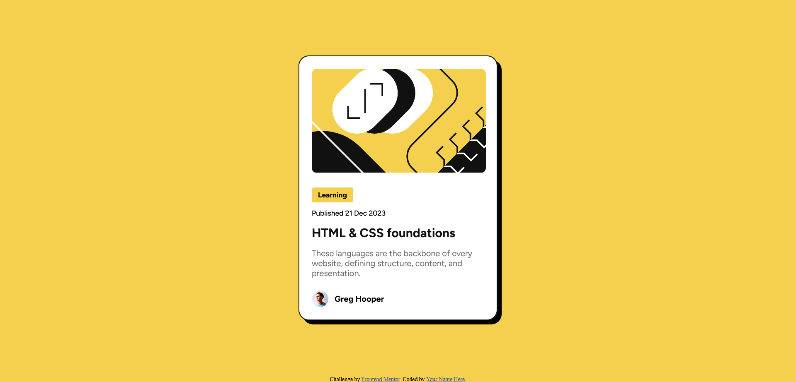

# Frontend Mentor - Blog preview card solution

This is a solution to the [Blog preview card challenge on Frontend Mentor](https://www.frontendmentor.io/challenges/blog-preview-card-ckPaj01IcS). Frontend Mentor challenges help you improve your coding skills by building realistic projects. 

## Table of contents

- [Overview](#overview)
  - [The challenge](#the-challenge)
  - [Screenshot](#screenshot)
  - [Links](#links)
- [My process](#my-process)
  - [Built with](#built-with)
  - [What I learned](#what-i-learned)
- [Author](#author)

## Overview

### The challenge

Users should be able to:

- See hover and focus states for all interactive elements on the page

### Screenshot



### Links

- Solution URL: [Add solution URL here](https://github.com/OAguilaLira/blog-preview-card-main)
- Live Site URL: [Add live site URL here](https://oaguilalira.github.io/blog-preview-card-main)

## My process

### Built with

- Semantic HTML5 markup
- CSS custom properties
- CSS Grid

### What I learned

Throughout this project, i reinforced several key web development concepts, especially related to semantic HTML and CSS layout (Flexbox and Grid).

One of the main lessons was how to properly distribute content vertically within the viewport. Initially, using height: 100vh on the main container caused the content to overlap with the footer on smaller screens. To fix this, I used Flexbox on the <body> and adjusted the layout with flex-direction: column, which allowed me to properly separate the main content from the footer without having to manually calculate heights.

```CSS
body {
  background-color: #F4D04E;
  height: 100vh;
  display: flex;
  flex-direction: column;
}
```

I also found it interesting to work with Grid on the .main-container, using place-items: center to easily and elegantly center the content.

```CSS
.main-container {
  display: grid;
  place-items: center;
  height: 100vh;
  font-family: "Figtree", sans-serif;
}
```

Another valuable takeaway was the use of semantic HTML structure. I used elements like <main>, <article>, <figure>, and <header> to properly describe the content, which improves accessibility and SEO.

```HTML
<main class="main-container">
  <article class="blog-card">
    <figure class="blog-card-image-container">
      
    </figure>
    <header>
      <h2 class="card-content-title"><a href="#">HTML & CSS foundations</a></h2>
    </header>
  </article>
</main>
```

Finally, I paid attention to details such as accessible hover states, rounded corners, and subtle shadows to create a visually appealing card, along with using a modern and readable font like Figtree from Google Fonts.

This project was a great exercise to strengthen my HTML and CSS fundamentals

## Author

- Website - [Add your name here](https://oaguilalira.github.io/Portafolio)
- Frontend Mentor - [@yourusername](https://www.frontendmentor.io/profile/AguilaxO)
